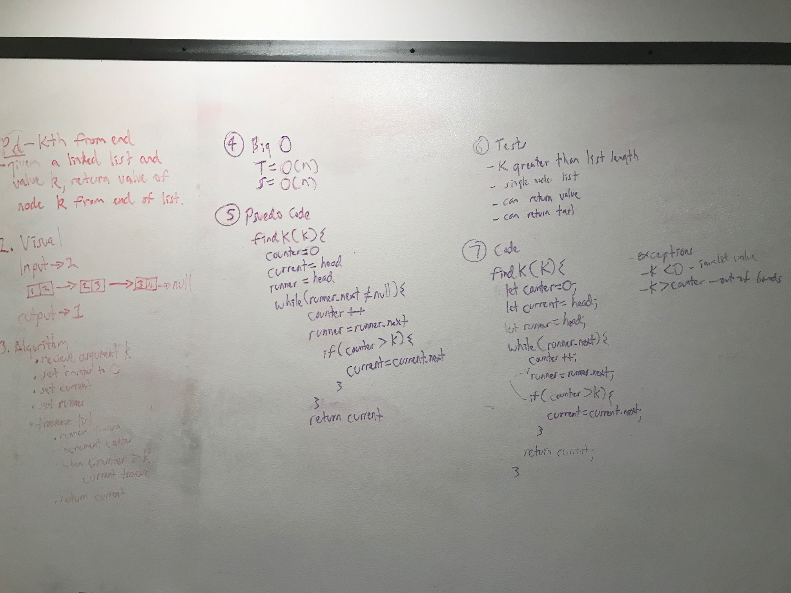

# Linked List Kth From End
This challenge involved finding a given value, k, from the end of a linked list.

## Challenge
This challenge was to:
-Given the value k, return the node value kth from the end of a linked list.

## Approach & Efficiency
My approach involved using a counter and a runner node. The runner began traversing the node, and each node travelled incremented the counter. When the counter was 1 past the value of K, the current would then increment. This ensures that the current stays at the value K from the end of the list, so when the traversal is complete, the current value is returned.  

The time and space complexity is:
Time = O(N)
Space = O(1)

## Solution

#### Acknowledgments
vladimirsan - starter code
